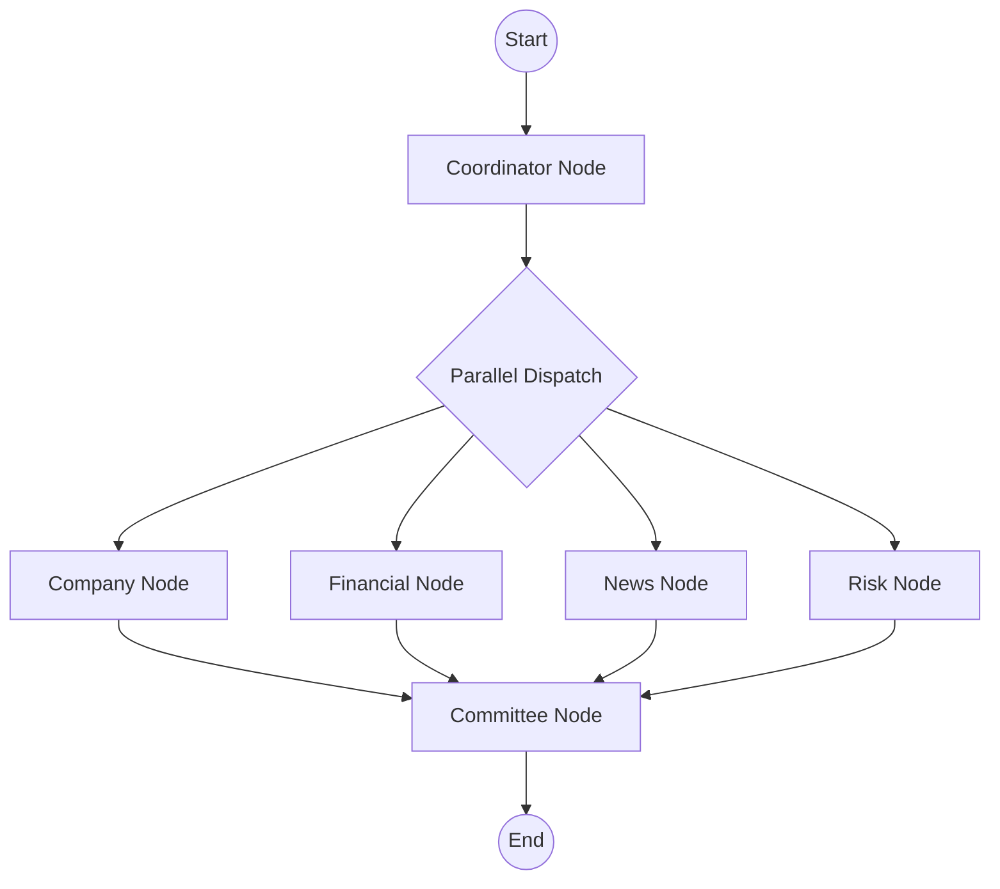

# AI Investment Research Agent

A Next.js, LangGraph, and Gemini-powered multi-agent system that performs comprehensive financial research and delivers structured investment recommendations.

## 🚀 Overview

The AI Investment Research Agent mimics a professional investment committee. You provide a company name, and a team of specialized AI agents asynchronously researches different dimensions of the business before synthesizing a final investment recommendation.

### The Agents
1. **Research Coordinator**: Determines company context, industry, and core identity.
2. **Company Agent**: Analyzes business models, competitive advantages, and market position.
3. **Finance Agent**: Analyzes revenue growth, profitability, and financial health.
4. **News Agent**: Analyzes recent developments, market sentiment, and catalysts.
5. **Risk Agent**: Assesses regulatory, execution, and competitive risks.
6. **Investment Committee**: Synthesizes the parallel outputs and generates an "INVEST" or "PASS" recommendation with a confidence score.

## 🏗️ Architecture



## ✨ Features
- **Parallel Orchestration**: Powered by LangGraph for concurrent AI agent execution.
- **Strictly Typed Structured Outputs**: Leverages LangChain with Zod schemas to guarantee parsable, deterministic JSON outputs from the LLM.
- **Production-grade Next.js App Router API**: Clean error bubbling, request validation, and timeout handling.
- **Modern UI**: Polished, responsive TailwindCSS dashboard with loading states, graceful failure states, and micro-animations.
- **Clean Architecture**: Strong separation of concerns across Services, Tools, Chains, Graph Nodes, and UI.

## 💻 Tech Stack
- **Framework**: Next.js 15 (App Router)
- **Language**: TypeScript
- **AI Orchestration**: LangGraph.js, LangChain.js
- **Model**: Google Gemini (`gemini-2.5-flash`)
- **Styling**: Tailwind CSS, lucide-react
- **Validation**: Zod

## 📂 Folder Structure

```
src/
├── app/                  # Next.js App Router pages & API routes
│   └── api/research/     # Core LangGraph execution endpoint
├── chains/               # LangChain prompt templates & structured outputs
├── components/           # React UI components (Dashboard, Cards, etc.)
├── graph/                # LangGraph state definitions & node implementations
├── lib/                  # Shared utilities (API clients, Zod schemas, Env validation)
├── services/             # External integration layers (Gemini API)
├── tools/                # Dynamic LangChain tools for agents
└── types/                # Global TypeScript definitions
```

## ⚙️ Installation & Local Development

1. **Clone the repository**
```bash
git clone https://github.com/ChetanYadav34/AI-Investment-Research-Agent.git
cd AI-Investment-Research-Agent
```

2. **Install dependencies**
```bash
npm install
```

3. **Configure Environment Variables**
Copy the example environment file:
```bash
cp .env.example .env.local
```
Add your Google Gemini API key to `.env.local`:
```env
GEMINI_API_KEY="your_api_key_here"
GEMINI_MODEL="gemini-2.5-flash"
```

4. **Run the Development Server**
```bash
npm run dev
```
Navigate to `http://localhost:3000` to interact with the application.

## 🚀 Deployment (Vercel)

This project is optimized for deployment on Vercel.

1. Push your code to GitHub.
2. Import the project into Vercel.
3. Add `GEMINI_API_KEY` to your Vercel Environment Variables.
4. Deploy!

*Note: Multi-agent generation takes 10-30 seconds. If deploying on Vercel's Free (Hobby) tier, you may encounter Serverless Function Timeout errors (which cap at 10-60s). Upgrading to Pro allows for the `maxDuration` parameter to extend to 5 minutes.*

## 🔮 Future Improvements
- **Live Financial Data Retrieval**: Integrating real API tools (e.g., AlphaVantage, Yahoo Finance) into the agent's toolset.
- **Real-time Streaming**: Emitting SSE (Server-Sent Events) from the LangGraph nodes to stream the thought processes to the UI in real-time.
- **Caching Layer**: Persisting analyzed reports to a database (e.g., Postgres, Redis) to avoid redundant LLM invocations.
